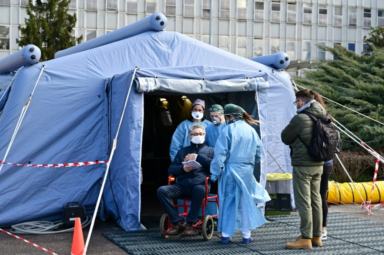
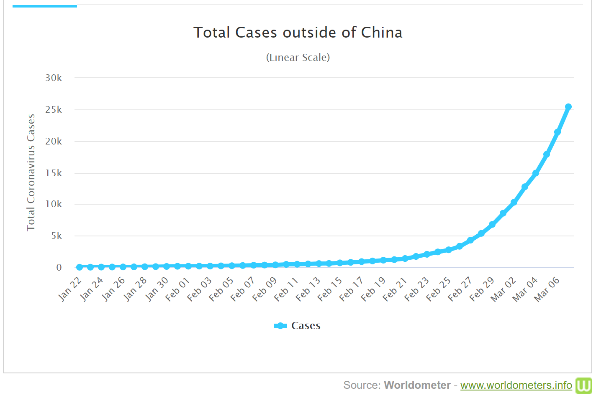
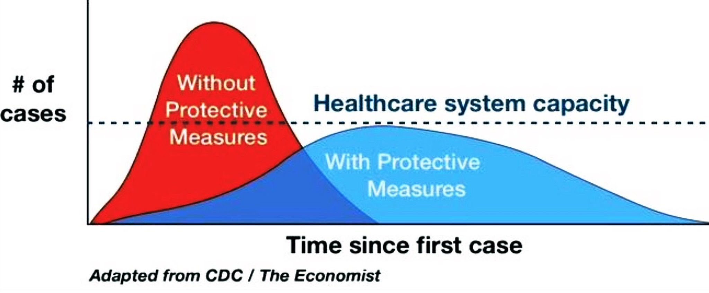
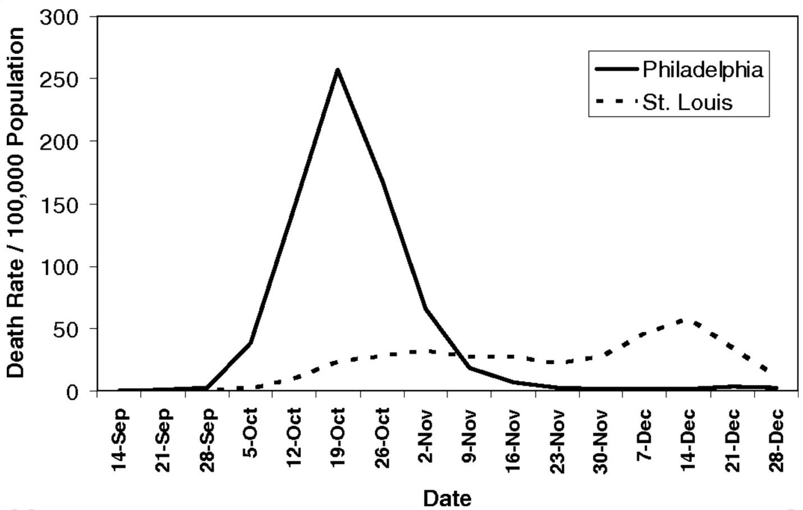
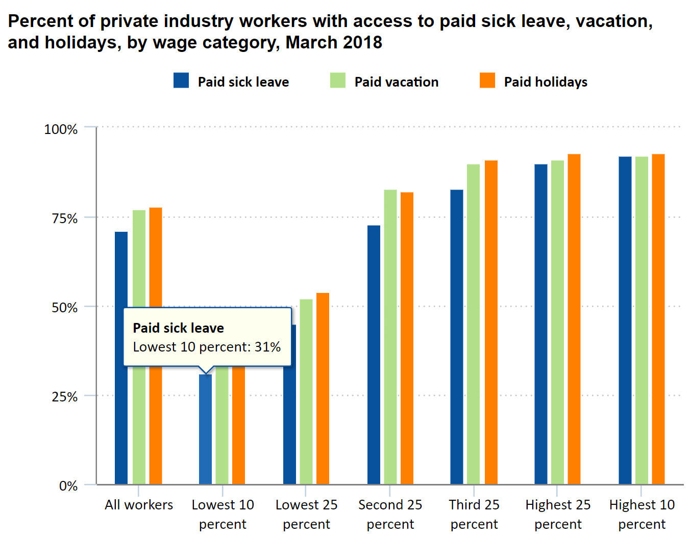

Original article: [https://www.fast.ai/2020/03/09/coronavirus/](https://www.fast.ai/2020/03/09/coronavirus/)

# Covid-19, your community, and you — a data science perspective

Written: 09 Mar 2020 by *Jeremy Howard* and *Rachel Thomas*

>We are data scientists—that is, our job is to understand how to analyze and interpret data. When we analyze the data around covid-19, we are very concerned. The most vulnerable parts of society, the elderly and the poor, are most at risk, but controlling the spread and impact of the disease requires us *all* to change our behavior. Wash your hands thoroughly and regularly, avoid groups and crowds, cancel events, and don’t touch your face. In this post, we explain why we are concerned, and you should be too. For an excellent summary of the key information you need to know, read [Corona in Brief](https://docs.google.com/document/u/1/d/1vumYWoiV7NlVoc27rMQvmVkVu5cOAbnaW_RKkq2RMaQ/mobilebasic?fbclid=IwAR0If1zzDDldgAy3DZmFhaxAmP046-dwAE_LCj3l9su2XLYpZe2By8mCj1A) by Ethan Alley (the president of a non-profit that develops technologies to reduce risks from pandemics).

### Translations

Anyone is welcome to translate this article, to help their local communities understand these issues. Please link back to here with appropriate credit. Let us know on [Twitter](https://twitter.com/jeremyphoward) so we can add your translation to this list.

* [French](https://medium.com/@xrb/covid-19-votre-communaut%C3%A9-et-vous-3e5f127910bc)
* [Spanish](https://datus.encryptedcommerce.net/public-health/2020/03/09/Covid-19-datascience-translation.html)
* [German](https://multitudes.github.io/posts/Covid19/)
* [Italian](https://medium.com/@ricangius/covid-19-la-tua-comunit%C3%A0-e-te-una-prospettiva-dalla-data-science-196845fc9275)
* [Romanian](https://www.nimirea.com/blog/2020/03/11/covid19-comunitatea-voastra-si-voi/)
* [Polish](https://medium.com/@maciekwilczynski/koronawirus-twoja-spo%C5%82eczno%C5%9B%C4%87-i-ty-perspektywa-danych-8c10122db5bd)
* [Portuguese (Brazil)](https://medium.com/@gpalmape/covid-19-sua-comunidade-e-voc%C3%AA-uma-perspectiva-de-ci%C3%AAncia-de-dados-cbdded20e436)
* [Chinese 中文简体](https://www.twofyw.me/update/2020/02/10/Covid-19,-your-community,-and-you.html)
* [Arabic](https://docs.google.com/document/d/1ze9wLkoUDrJV3le3PKB64q1sOgtNU6KtynBywTBj2os/edit)
* [Thai](https://medium.com/mmaetha/covid-19-%E0%B8%AA%E0%B8%B1%E0%B8%87%E0%B8%84%E0%B8%A1-%E0%B9%81%E0%B8%A5%E0%B8%B0%E0%B8%95%E0%B8%B1%E0%B8%A7%E0%B8%84%E0%B8%B8%E0%B8%93%E0%B9%80%E0%B8%AD%E0%B8%87-%E0%B9%83%E0%B8%99%E0%B8%A1%E0%B8%B8%E0%B8%A1%E0%B8%A1%E0%B8%AD%E0%B8%87%E0%B8%82%E0%B8%AD%E0%B8%87%E0%B8%A7%E0%B8%B4%E0%B8%97%E0%B8%A2%E0%B8%B2%E0%B8%A8%E0%B8%B2%E0%B8%AA%E0%B8%95%E0%B8%A3%E0%B9%8C%E0%B8%82%E0%B9%89%E0%B8%AD%E0%B8%A1%E0%B8%B9%E0%B8%A5-1323c34fd4df)
* [Marathi](https://fintalklabs.com/covid-19-corona-virus/)
* [Kannada](https://drive.google.com/file/d/1D7PEwRXM4KUyOze9_2D0JxwJdDWi8Ihu/view)
* [Swahili](https://asvcode.github.io/covid19-translations/markdown/2020/03/10/Swahili.html)

### Contents

* We need a working medical system
* This is not like the flu
* “Don’t panic. Keep calm.” is not helpful
* It’s not just about you
* We need to flatten the curve
* A community’s reaction makes all the difference
* We don’t have good information in the US
* In conclusion

## We need a working medical system

Just over 2 years ago one of us (Rachel) got a brain infection which kills around 1/4 of people who get it, and leaves 1/3 with permanent cognitive impairment. Many others end up with permanent vision and hearing damage. Rachel was delirious by the time she crawled across the hospital parking lot. She was lucky enough to receive prompt care, diagnosis, and treatment. Up until shortly before this event Rachel was in great health. Having prompt access to the emergency room almost certainly saved her life.

Now, let’s talk about covid-19, and what might happen to people in Rachel’s situation in the coming weeks and months. The number of people found to be infected with covid-19 doubles every 3 to 6 days. With a doubling rate of three days, that means the number of people found to be infected can increase 100 times in three weeks (it’s not actually quite this simple, but let’s not get distracted by technical details). One in 10 infected people requires hospitalization for many weeks, and most of these require oxygen. Although it is very early days for this virus, there are already regions where hospitals are entirely overrun, and people are no longer able to get the treatment that they require (not only for covid-19, but also for anything else, such as the life-saving care that Rachel needed). For instance, in Italy, where just a week ago officials were saying that everything was fine, now sixteen million people have been put on lock-down (*update: 6 hours after posting this, Italy put the entire country on lock-down*), and tents like this are being set up to help handle the influx of patients:

*A medical tent used in Italy*

Dr. Antonio Pesenti, head of the regional crisis response unit in a hard-hit area of Italy, said, “We’re now being forced to set up intensive care treatment in corridors, in operating theaters, in recovery rooms... One of the best health systems in the world, in Lombardy is a step away from collapse.”

## This is not like the flu

The flu has a death rate of around 0.1% of infections. Marc Lipsitch, the director of the Center for Communicable Disease Dynamics at Harvard, [estimates that](https://www.washingtonpost.com/opinions/2020/03/06/why-its-so-hard-pin-down-risk-dying-coronavirus/) for covid-19 it is 1-2%. The [latest epedemiological modeling](https://www.medrxiv.org/content/10.1101/2020.03.04.20031104v1.full.pdf) found a 1.6% rate in China in February, sixteen times higher than the flu[^1] (this might be quite a conservative number however, because rates go up a lot when the medical system can’t cope). Current best estimates expect that covid-19 will kill 10 times more people this year than the flu (and [modeling by Elena Grewal](https://docs.google.com/spreadsheets/d/1ktSfdDrX_uJsdM08azBflVOm4Z5ZVE75nA0lGygNgaA/edit?usp=sharing), former director of data science at Airbnb, shows it could be 100 times more, in the worst case). This is before taking into consideration the huge impact on the medical system, such as that described above. It is understandable that some people are trying to convince themselves that this is nothing new, an illness much like the flu, because it is very uncomfortable to accept the reality that this is not familiar at all.

Trying to understand intuitively an exponentially increasing growth in the number of infected people is not something that our brains are designed to handle. So we have to analyze this as scientists, not using our intuition.

*Where will this be in 2 weeks? 2 months?*

For each person that has the flu, on average, they infect 1.3 other people. That’s called the “R0” for flu. If R0 is less than 1.0, then an infection stops spreading and dies out. If it’s over 1.0, it spreads. R0 currently is 2-3 for covid-19 outside China. The difference may sound small, but after 20 “generations” of infected people passing on their infection, an R0 of 1.3 would result in 146 infections, but an R0 of 2.5 would result in 36 million infections! (This is, of course, very hand-wavy and ignores many real-world impacts, but it’s a reasonable illustration of the *relative* difference between covid-19 and flu, all other things being equal).

Note that R0 is not some fundamental property of a disease. It depends greatly on the response, and it can change over time[^2]. Most notably, in China R0 for covid-19 has come down greatly, and is now approaching 1.0! How, you ask? By putting in place measures at a scale that would be hard to imagine in a country such as the US—for instance, entirely locking down many giant cities, and developing a testing process that allows more than a million people a week to be tested.

One thing which comes up a lot on social media (including from highly-followed accounts such as Elon Musk) is a misunderstanding of the difference between *logistic* and *exponential* growth. “Logistic” growth refers to the “s-shaped” growth pattern of epidemic spread in practice. Obviously exponential growth can’t go on forever, since otherwise there would be more people infected than people in the world! Therefore, eventually, infection rates must always decreasing, resulting in an s-shaped (known as *sigmoid*) growth rate over time. However, the decreasing growth only occurs for a reason–it’s not magic. The main reasons are:

* Massive and effective community response, or
* Such a large percentage of people are infected that there’s fewer uninfected people to spread to.

Therefore, it makes no logical sense to rely on the logistic growth pattern as a way to “control” a pandemic.

Another thing which makes it hard to intuitively understand the impact of covid-19 in your local community is that there is a very significant delay between infection and hospitalization — generally around 11 days. This may not seem like a long time, but when you compare it to the number of people infected during that time, it means that by the time you notice that the hospital beds are full, community infection is already at a level that there will be 5-10 times more people to deal with.

Note that there are some early signs that the impact in your local area may be at least somewhat dependent on climate. The paper Temperature and latitude analysis to predict potential spread and seasonality for COVID-19 points out that the disease has so far been spreading in mild climates (unfortunately for us, the temperature range in San Francisco, where we live, is right in that range; it also covers the main population centers of Europe, including London.)

## “Don’t panic. Keep calm.” is not helpful

One common response we’ve seen on social media to people that are pointing out the reasons to be concerned, is “don’t panic” or “keep calm”. This is, to say the least, not helpful. No-one is suggesting that panic is an appropriate response. For some reason, however, “keep calm” is a very popular reaction in certain circles (but not amongst any epidemiologists, whose job it is to track these things). Perhaps “keep calm” helps some people feel better about their own inaction, or makes them feel somehow superior to people who they imagine are running around like a headless chicken.

But “keep calm” can easily lead to a failure to prepare and respond. In China, tens of millions were put on lock-down and two new hospitals were built by the time they reached the statistics that the US has now. Italy waited too long, and just today (Sunday March 8) they reported 1492 new cases and 133 new deaths, despite locking down 16 million people. Based on the best information we’re able to ascertain at this stage, just 2-3 weeks ago Italy was in the same position that the US and UK are in today (in terms of infection statistics).

Note that nearly everything about covid-19 at this stage is up in the air. We don’t really know it’s infection speed or mortality, we don’t know how long it remains active on surfaces, we don’t know whether it survives and spreads in warm conditions. Everything we have is current best guesses based on the best information people are able to put together. And remember, the vast majority of this information is in China, in Chinese. Currently, the best way to understand the Chinese experience so far is to read the excellent [Report of the WHO-China Joint Mission on Coronavirus Disease 2019](https://www.who.int/docs/default-source/coronaviruse/who-china-joint-mission-on-covid-19-final-report.pdf), based on a joint mission of 25 national and international experts from China, Germany, Japan, Korea, Nigeria, Russia, Singapore, the United States of America and the World Health Organization (WHO).

When there’s some uncertainty, that perhaps this won’t be a global pandemic, and perhaps everything just *might* pass by without the hospital system collapsing, that doesn’t mean that the right response is to do nothing. That would be enormously speculative and not an optimal response under any threat modeling scenario. It also seems extremely unlikely that countries like Italy and China would effectively shut down large parts of their economy for no good reason. It’s also not consistent with the actual impacts we’re seeing on the ground in infected areas, where the medical system is unable to cope (for instance, Italy is using 462 tents for “pre-triage”, and still has to [move ICU patients from infected areas](https://www.repubblica.it/cronaca/2020/03/08/news/coronavirus_situazione_italia-250665818/?ref=RHPPTP-BH-I250661466-C12-P5-S1.12-T1)).

Instead, the thoughtful, reasonable response is to follow the steps that are recommended by experts to avoid spreading infections:

* Avoid large groups and crowds
* Cancel events
* Work from home, if at all possible
* Wash hands when coming and going from home, and frequently when out
* Avoid touching your face, especially when outside your home (not easy!)
* Disinfect surfaces and packages (it’s possible the virus may remain active for 9 days on surfaces, although this still isn’t known for sure either way).

## It’s not just about you

If you are under 50, and do not have risk factors such as a compromised immune system, cardiovascular disease, a history of previous smoking, or other chronic illnesses, then you can have some comfort that covid-19 is unlikely to kill you. But how you respond still matters very much. You still have just as much chance of getting infected, and if you do, just as much chance of infecting others. On average, each infected person is infecting over two more people, and they become infectious before they show symptoms. If you have parents that you care about, or grandparents, and plan to spend time with them, and later discover that you are responsible for infecting them with covid-19, that would be a heavy burden to live with.

Even if you are not in contact with people over 50, it is likely that you have more coworkers and acquaintances with chronic illnesses than you realize. [Research shows](https://www.talentinnovation.org/_private/assets/DisabilitiesInclusion_KeyFindings-CTI.pdf) that few people disclose their health conditions in the workplace if they can avoid it, for [fear of discrimination](https://medium.com/@racheltho/the-tech-industry-is-failing-people-with-disabilities-and-chronic-illnesses-8e8aa17937f3). Both of us are in high risk categories, but many people who we interact with regularly may not have known this.

And of course, it is not just about the people immediately around you. This is a highly significant ethical issue. Each person who does their best to contribute to controlling the spread of the virus is helping their whole community to slow down the rate of infection. As Zeynep Tufekci [wrote in Scientific Amercian](https://blogs.scientificamerican.com/observations/preparing-for-coronavirus-to-strike-the-u-s/): “Preparing for the almost inevitable global spread of this virus… is one of the most pro-social, altruistic things you can do”. She continues:

>We should prepare, not because we may feel personally at risk, but so that we can help lessen the risk for everyone. We should prepare not because we are facing a doomsday scenario out of our control, but because we can alter every aspect of this risk we face as a society. That’s right, you should prepare because your neighbors need you to prepare—especially your elderly neighbors, your neighbors who work at hospitals, your neighbors with chronic illnesses, and your neighbors who may not have the means or the time to prepare because of lack of resources or time.

This has impacted us personally. The biggest and most important course we’ve ever created at fast.ai, which represents the culmination of years of work for us, was scheduled to start at the University of San Francisco in a week. Last Wednesday (March 4), we made the decision to move the [whole thing online](https://twitter.com/jeremyphoward/status/1236088745251581952). We were one of the first large courses to move online. Why did we do it? Because we realized early last week that if we ran this course, we were implicitly encouraging hundreds of people to get together in an enclosed space, multiple times over a multi-week period. Bringing groups together in enclosed spaces is the single worst thing that can be done. We felt ethically obliged to ensure that, at least in this case, this didn’t happen. It was a heart-breaking decision. Our time spent working directly with our students has been one of the great pleasures and most productive periods every year. And we had students planning to fly in from all over the world, who we really didn’t want to let down[^3].

But we knew it was the right thing to do, because otherwise we’d be likely to be increasing the spread of the disease in our community[^4].

## We need to flatten the curve

This is extremely important, because if we can slow down the rate of infection in a community, then we give hospitals in that community time to deal with both the infected patients, and with the regular patient load that they need to handle. This is described as “flattening the curve”, and is clearly shown in this illustrative chart:

*Staying under that dotted line means everything*

Farzad Mostashari, the former National Coordinator for Health IT, explained: “New cases are being identified every day that do not have a travel history or connection to a known case, *and we know that these are just the tip of the iceberg* because of the delays in testing. That means that in the next two weeks the number of diagnosed cases will explode… Trying to do containment when there is exponential community spread is like focusing on putting out sparks when the house is on fire. When that happens, we need to switch strategies to mitigation–taking protective measures to slow spread & reduce peak impact on healthcare.” If we can keep the spread of disease low enough that our hospitals can handle the load, then people can access treatment. But if the cases come too quickly, then those that need hospitalization won’t get it.

Here’s what the math might look like, [according to Liz Specht](https://twitter.com/LizSpecht/status/1236095186737852416):

>The US has about 2.8 hospital beds per 1000 people. With a population of 330M, this is ~1M beds. At any given time, 65% of those beds are already occupied. That leaves about 330k beds available nationwide (perhaps a bit fewer this time of year with regular flu season, etc). Let’s trust Italy’s numbers and assume that about 10% of cases are serious enough to require hospitalization. (Keep in mind that for many patients, hospitalization lasts for *weeks* — in other words, turnover will be *very* slow as beds fill with COVID19 patients). By this estimate, by about May 8th, all open hospital beds in the US will be filled. (This says nothing, of course, about whether these beds are suitable for isolation of patients with a highly infectious virus.) If we’re wrong by a factor of two regarding the fraction of severe cases, that only changes the timeline of bed saturation by 6 days in either direction. If 20% of cases require hospitalization, we run out of beds by ~May 2nd If only 5% of cases require it, we can make it until ~May 14th. 2.5% gets us to May 20th. This, of course, assumes that there is no uptick in demand for beds from *other* (non-COVID19) causes, which seems like a dubious assumption. As healthcare system becomes increasingly burdened, Rx shortages, etc, people w/ chronic conditions that are normally well-managed may find themselves slipping into severe states of medical distress requiring intensive care & hospitalization.

## A community’s reaction makes all the difference

As we’ve discussed, this math isn’t a certainty—China has already shown that it’s possible to reduce the spread by taking extreme steps. Another great example of a successful response is Vietnam, where, amongst other things, a nationwide advertising campaign (including a catchy song!) quickly mobilized community response and ensured that people adjusted their behavior appropriately.

This is not just a hypothetical situation — it was clearly displayed in the 1918 flu pandemic. In the United States two cities displayed very different reactions to the pandemic: Philadelphia went ahead with a giant parade of 200,000 people to help raise money for the war. But St Louis put in place carefully designed processes to minimize social contacts so as to decrease the spread of the virus, along with cancelling all large events. Here is what the number of deaths looked like in each city, as shown in the [Proceedings of the National Academy of Sciences](https://www.pnas.org/content/104/18/7582):

*Impact of differing responses to the 1918 Flu pandemic*

The situation in Philadelphia became extremely dire, even getting to a point where there [were not enough funeral caskets or morgues](https://www.history.com/news/spanish-flu-pandemic-dead) to handle the huge number of dead from the flu.

Richard Besser, who was acting director of the Centers for Disease Control and Prevention during the 2009 H1N1 pandemic, [says that](https://www.washingtonpost.com/opinions/as-coronavirus-spreads-the-bill-for-our-public-health-failures-is-due/2020/03/05/9da09ed6-5f10-11ea-b29b-9db42f7803a7_story.html?utm_campaign=wp_week_in_ideas&utm_medium=email&utm_source=newsletter&wpisrc=nl_ideas) in the US “the risk of exposure and the ability to protect oneself and one’s family depends on income, access to health care, and immigration status, among other factors.” He points out that:

>The elderly and disabled are at particular risk when their daily lives and support systems are disrupted. Those without easy access to health care, including rural and Native communities, might face daunting distances at times of need. People living in close quarters — whether in public housing, nursing homes, jails, shelters or even the homeless on the streets — might suffer in waves, as we have already seen in Washington state. And the vulnerabilities of the low-wage gig economy, with non-salaried workers and precarious work schedules, will be exposed for all to see during this crisis. Ask the 60 percent of the U.S. labor force that is paid hourly how easy it is to take time off in a moment of need.

The US Bureau of Labor Statistics shows that [less than a third](https://www.bls.gov/opub/ted/2018/higher-wage-workers-more-likely-than-lower-wage-workers-to-have-paid-leave-benefits-in-2018.htm) of those in the lowest income band have access to paid sick leave:

*Most poor Americans do not have sick leave, so have to go to work.*

## We don’t have good information in the US

One of the big issues in the US is that very little testing is being done, and testing results aren’t being properly shared, which means we don’t know what’s actually happening. Scott Gottlieb, the previous FDA commissioner, explained that in Seattle there has been better testing, and we are seeing infection there: “The reason why we knew early about Seattle outbreak of covid-19 was because of sentinel surveillance work by independent scientists. Such surveillance never got totally underway in other cities. So other U.S. hot spots may not be fully detected yet.” According to [The Atlantic](https://www.theatlantic.com/health/archive/2020/03/how-many-americans-have-been-tested-coronavirus/607597/), Vice President Mike Pence promised that “roughly 1.5 million tests” would be available this week, but less than 2,000 people have been tested throughout the US at this point. Drawing on work from [The COVID Tracking Project](https://docs.google.com/spreadsheets/u/1/d/e/2PACX-1vRwAqp96T9sYYq2-i7Tj0pvTf6XVHjDSMIKBdZHXiCGGdNC0ypEU9NbngS8mxea55JuCFuua1MUeOj5/pubhtml), Robinson Meyer and Alexis Madrigal of The Atlantic, said:

>The figures we gathered suggest that the American response to the covid-19 and the disease it causes, COVID-19, has been shockingly sluggish, especially compared with that of other developed countries. The CDC confirmed eight days ago that the virus was in community transmission in the United States—that it was infecting Americans who had neither traveled abroad nor were in contact with others who had. In South Korea, more than 66,650 people were tested within a week of its first case of community transmission, and it quickly became able to test 10,000 people a day.

Part of the problem is that this has become a political issue. In particular, President Donald Trump has made it clear that he wants to see “the numbers” (that as, the number of people infected in the US) kept low. This is an example of where optimizing metrics interferes with getting good results in practice. (For more on this issue, see the Ethics of Data Science paper [The Problem with Metrics is a Fundamental Problem for AI](https://arxiv.org/abs/2002.08512)). Google’s Head of AI [Jeff Dean, tweeted](https://twitter.com/JeffDean/status/1236489084870119427) his concern about the problems of politicized disinformation:

>When I worked at WHO, I was part of the Global Programme on AIDS (now UNAIDS), created to help the world tackle the HIV/AIDS pandemic. The staff there were dedicated doctors and scientists intensely focused on helping address that crisis. In times of crisis, clear and accurate information is vital to helping everyone make proper and informed decisions about how to respond (country, state, and local governments, companies, NGOs, schools, families, and individuals). With the right information and policies in place for listening to the best medical and scientific experts, we will all come through challenges like the ones presented by HIV/AIDS or by COVID-19. With disinformation driven by political interests, there’s a real risk of making things way, way worse by not acting quickly and decisively in the face of a growing pandemic, and by actively encouraging behaviors that will actually spread the disease more quickly. This whole situation is incredibly painful to watch unfold.

It doesn’t look like there is the political will to turn things around, when it comes to transparency. Health and Human Services Secretary Alex Azar, [according to Wired](https://www.wired.com/story/trumps-coronavirus-press-event-was-even-worse-than-it-looked/), “started talking about the tests health care workers use to determine if someone is infected with the new coronavirus. The lack of those kits has meant a dangerous lack of epidemiological information about the spread and severity of the disease in the US, exacerbated by opacity on the part of the government. Azar tried to say that more tests were on the way, pending quality control.” But, they continued:

>Then Trump cut Azar off. “But I think, importantly, anybody, right now and yesterday, that needs a test gets a test. They’re there, they have the tests, and the tests are beautiful. Anybody that needs a test gets a test,” Trump said. This is untrue. Vice President Pence told reporters Thursday that the US didn’t have enough test kits to meet demand.

Other countries are reacting much more quickly and significantly than the US. Many countries in SE Asia are showing great results, including Taiwan, where R0 is down to 0.3 now, and Singapore, which is being proposed as [The Model for COVID-19 Response](https://www.medpagetoday.com/infectiousdisease/covid19/85254). It’s not just in Asia though; in France, for instance, any gathering of >1000 people is forbidden, and schools are now closed in three districts.

## In conclusion

Covid-19 is a significant societal issue, and we can, and should, all work to decrease the spread of the disease. This means:

* Avoiding large groups and crowds
* Canceling events
* Working from home, if at all possible
* Washing hands when coming and going from home, and frequently when out
* Avoiding touching your face, especially when outside your home.

*Note: due to the urgency of getting this out, we haven’t been as careful as we normally like to be about citing and crediting the work we’re relying on. Please let us know if we’ve missed anything.*

*Thanks to Sylvain Gugger and Alexis Gallagher for feedback and comments.*

### Footnotes
(Click ↩ on a footnote to go back to where you were.)
[^1]: *Epidemiologists* are people who study the spread of disease. It turns out that estimating things like mortality and R0 are actually pretty challenging, so there is a whole field that specializes in doing this well. Be wary of people who use simple ratios and statistics to tell you how covid-19 is behaving. Instead, look at modeling done by epidemiologists.
[^2]: Well, not technically true. “R0” strictly speaking refers to the infection rate in the absence of response. But since that’s not really ever the thing that we care about, we’ll let ourselves be a bit sloppy on our definitions here.
[^3]: Since that decision, we’ve worked hard to find a way to run a virtual course which we hope will be even better than the in-person version would have been. We’ve been able to open it up to anyone in the world, and will be running virtual study and project groups every day.
[^4]: We’ve made many other smaller changes to our lifestyle too, including exercising at home instead of going to the gym, moving all our meetings to video-conference, and skipping night events that we’d been looking forward to.